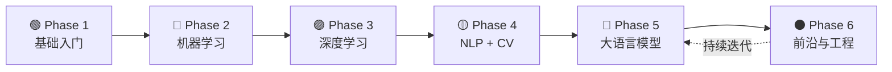

# 🧠 AI 学习路线图 — 从小白到大神

> **目标**：从零开始，系统化学习人工智能，最终具备独立研究、开发和落地 AI 项目的能力。
> **路径**：6 个阶段 + 贯穿始终的实践 + 论文阅读。

```dataview
TABLE without id
  "▶ " + file.link as "阶段",
  duration as "时长估算",
  status as "状态"
FROM ""
WHERE phase
SORT phase asc
```

---

## 📊 总览（6 阶段飞轮）



| 阶段 | 名称 | 核心内容 | 预估耗时 | 难度 |
|------|------|---------|---------|------|
| [[01.编程基础/01.00 Phase1-基础入门\|Phase 1]] | 🟢 基础入门 | Python + 数学 + 工具链 | 4-6 周 | ⭐ |
| [[03.机器学习/03.00 Phase2-机器学习\|Phase 2]] | 🔵 机器学习 | 经典算法 + Sklearn | 6-8 周 | ⭐⭐ |
| [[04.深度学习/04.00 Phase3-深度学习\|Phase 3]] | 🟣 深度学习 | 神经网络 + CNN/RNN + PyTorch | 8-10 周 | ⭐⭐⭐ |
| [[05.NLP/05.00 Phase4-NLP与CV\|Phase 4]] | 🟡 NLP & CV | Transformer + 图像 | 6-8 周 | ⭐⭐⭐ |
| [[07.大语言模型LLM/07.00 Phase5-大语言模型\|Phase 5]] | 🔴 大语言模型 | GPT/LLaMA + RAG + Agent | 8-12 周 | ⭐⭐⭐⭐ |
| [[08.前沿与工程化/08.00 Phase6-前沿与工程化\|Phase 6]] | ⚫ 前沿 & 工程 | MLOps + 论文 + 落地 | 持续 | ⭐⭐⭐⭐⭐ |

---

## 🧰 推荐 Obsidian 插件清单

> 这些插件将贯穿整个学习过程，建议在 Phase 1 就配置好。

### 核心必装

| 插件             | 用途                         | 安装方法              |
| -------------- | -------------------------- | ----------------- |
| **Dataview**   | 用 SQL-like 查询管理笔记，自动生成进展看板 | 社区插件 → Dataview   |
| **Templater**  | 创建笔记模板（如"每日学习笔记"模板）        | 社区插件 → Templater  |
| **Excalidraw** | 手绘神经网络结构图、流程图              | 社区插件 → Excalidraw |
| **Kanban**     | 看板模式管理学习任务进度               | 社区插件 → Kanban     |

### 效率增强

| 插件                    | 用途                                        |
| --------------------- | ----------------------------------------- |
| **Latex Suite**       | 快速输入数学公式（$\frac{\partial L}{\partial w}$） |
| **Spaced Repetition** | 间隔重复，记忆 ML 概念和面试题                         |
| **Annotator**         | 在 Obsidian 内直接标注 PDF 论文                   |
| **Code Preview**      | 预览代码块运行结果                                 |
| **Obsidian Git**      | 自动备份笔记到 GitHub                            |
| **Mermaid**           | 内置，画各种架构图、流程图                             |

### AI 专属

| 插件                | 用途                        |
| ----------------- | ------------------------- |
| **Copilot (moy)** | 在笔记内与 LLM 对话，辅助理解概念       |
| **Jupyter (社区版)** | 在 Obsidian 中运行 Python 代码块 |

### Phase 1 一键配置清单

参见 → [[01.编程基础/01.90 Obsidian插件配置指南]]

---

## 🔄 学习方法论

### 每日学习流程
```
09:00 - 10:00  阅读 + 笔记（Obsidian 记录）
10:00 - 12:00  动手实践（代码 + 实验）
14:00 - 16:00  深入 + 写笔记（用自己的话总结）
16:00 - 17:00  复习 + 间隔重复卡片
```

### 笔记原则
1. **Feynman 法** — 用自己的话解释，假装教给完全不懂的人
2. **不摘抄，要转化** — 拒绝 CV，每段笔记都是"我理解后的产物"
3. **建立链接** — 每篇笔记至少链接 3 篇其他笔记
4. **实践驱动** — 每学一个概念，必有对应的代码/实验

---

## 🎯 里程碑检查点

- [ ] Phase 1 — 能用 Python 处理数据、看懂基础数学公式
- [ ] Phase 2 — 能独立完成一个 Kaggle 入门比赛
- [ ] Phase 3 — 能用手写神经网络做图像/文本分类
- [ ] Phase 4 — 能实现一个 Transformer 小模型
- [ ] Phase 5 — 能用 LangChain 搭建 RAG 应用 / 微调一个小模型
- [ ] Phase 6 — 能复现顶会论文、部署生产级模型

---

## 📚 推荐学习资源

| 资源 | 类型 | 对应阶段 |
|------|------|---------|
| [CS229 (Stanford ML)](https://cs229.stanford.edu/) | 课程 | Phase 2 |
| [Fast.ai](https://www.fast.ai/) | 课程+实战 | Phase 2-3 |
| [d2l.ai (动手学深度学习)](https://d2l.ai/) | 书籍+代码 | Phase 3-4 |
| [CS231n](http://cs231n.stanford.edu/) | 课程 | Phase 4 |
| [Hugging Face Course](https://huggingface.co/learn/nlp-course) | 课程 | Phase 5 |
| [LLM University (Cohere)](https://cohere.com/llmu) | 课程 | Phase 5 |
| [Andrej Karpathy 系列](https://karpathy.ai/) | 视频+博客 | Phase 3-6 |

---

## 📌 快速跳转

- [[01.编程基础/01.00 Phase1-基础入门|▶ 进入 Phase 1：基础入门]]
- [[09.实践项目/09.00 实践项目索引|▶ 查看所有实践项目]]
- [[99.资源与工具/99.02 学习资源汇总|▶ 学习资源汇总]]
- [[99.资源与工具/99.01 Obsidian学习工作流|▶ Obsidian 学习工作流]]

---

*最后更新：2026-05-19*
