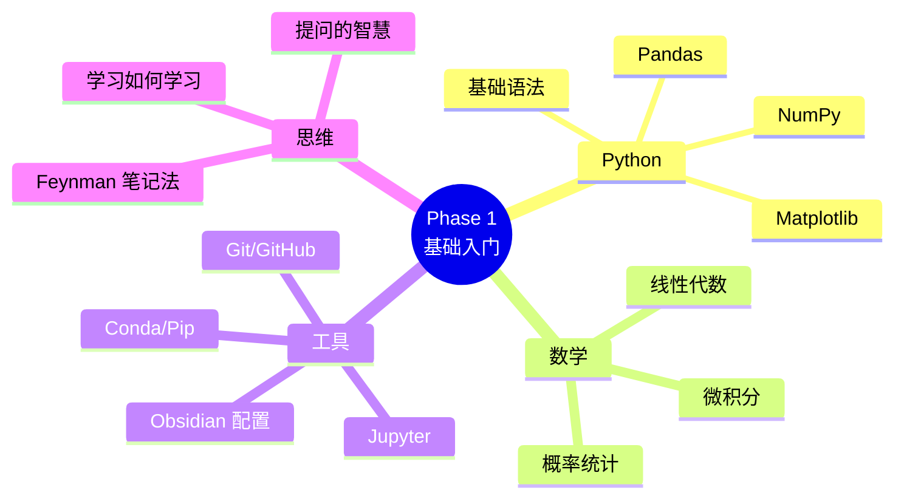

# 🟢 Phase 1：基础入门

> **目标**：搭建完整的学习环境，掌握 Python 数据处理与基础数学，为后续 ML/DL 打好地基。

---

## 📋 本阶段学习清单

```dataview
TASK FROM "01.编程基础/01.00 Phase1-基础入门"
WHERE !completed
SORT section asc
```

---

## 📂 知识结构



---

## 🐍 第一部分：Python 编程

> **目标**：能熟练用 Python 处理数据、写函数、画图。

### 1.1 Python 基础语法
- [ ] 变量、数据类型、控制流（if/for/while）
- [ ] 函数与 Lambda
- [ ] 列表推导式、生成器
- [ ] 文件读写（txt / csv / json）
- [ ] 异常处理
- [ ] 面向对象基础（类、继承、魔法方法）

**实践** → [[01.编程基础/01.02 Python基础练习]]
**参考**：[Python 官方教程](https://docs.python.org/zh-cn/3/tutorial/)

### 1.2 NumPy — 数值计算基石
- [ ] 创建数组（np.array, np.zeros, np.arange）
- [ ] 索引、切片、广播机制
- [ ] 矩阵运算（点积、转置、求逆）
- [ ] 随机数生成
- [ ] 统计函数（mean, std, sum）

**实践** → [[01.编程基础/01.03 NumPy实战：矩阵运算与线性代数]]

### 1.3 Pandas — 数据处理利器
- [ ] Series 与 DataFrame 创建
- [ ] 数据读取（read_csv, read_excel）
- [ ] 数据清洗（dropna, fillna, 去重）
- [ ] 分组与聚合（groupby, pivot_table）
- [ ] 合并（merge, concat）

**实践** → [[01.编程基础/01.04 Pandas实战：数据清洗与分析]]

### 1.4 Matplotlib + Seaborn — 数据可视化
- [ ] 折线图、散点图、柱状图、直方图
- [ ] 子图布局
- [ ] 美化样式
- [ ] 热力图、箱线图

**实践** → [[01.编程基础/01.05 数据可视化实战]]

---

## 📐 第二部分：数学基础

> **目标**：能看懂 ML 教材里的公式，不要求精通推导，但要理解直觉。

### 2.1 线性代数 — AI 的"语言"
| 概念 | 重要性 | 说明 |
|------|--------|------|
| 向量与矩阵 | 🔴 必备 | 所有数据都被表示成向量/矩阵 |
| 矩阵乘法 | 🔴 必备 | 神经网络的前向传播 |
| 转置与逆矩阵 | 🟡 重要 | 线性回归闭式解 |
| 特征值与特征向量 | 🟡 重要 | PCA 降维 |
| SVD 分解 | 🟢 了解 | 推荐系统 |

**实践** → [[02.数学基础/02.01 线性代数实战（NumPy）]]

### 2.2 微积分 — 优化的核心
| 概念 | 重要性 | 说明 |
|------|--------|------|
| 导数与偏导数 | 🔴 必备 | 梯度下降 |
| 链式法则 | 🔴 必备 | 反向传播 |
| 梯度与方向导数 | 🔴 必备 | 优化理论基础 |
| 泰勒展开 | 🟡 重要 | 理解优化算法 |
| 拉格朗日乘数法 | 🟢 了解 | SVM 原理 |

**实践** → [[02.数学基础/02.02 微积分实战：梯度下降从零实现]]

### 2.3 概率统计 — 不确定性的语言
| 概念 | 重要性 | 说明 |
|------|--------|------|
| 概率分布（正态、伯努利） | 🔴 必备 | 理解模型输出 |
| 条件概率与贝叶斯定理 | 🔴 必备 | 生成模型基础 |
| 期望与方差 | 🔴 必备 | 模型评估 |
| 极大似然估计 | 🟡 重要 | 模型训练原理 |
| 假设检验 | 🟢 了解 | A/B 测试 |

**实践** → [[02.数学基础/02.03 概率统计实战：贝叶斯分类器]]

---

## 🔧 第三部分：工具链搭建

### 3.1 Python 环境管理
```bash
# 推荐方案：Miniconda
# 1. 下载 Miniconda
# 2. 创建 AI 学习环境
conda create -n ai-learning python=3.11
conda activate ai-learning

# 3. 安装必备包
pip install numpy pandas matplotlib seaborn scikit-learn jupyter
pip install torch torchvision --index-url https://download.pytorch.org/whl/cu118
```

### 3.2 Jupyter Notebook / Jupyter Lab
- [ ] 安装与启动
- [ ] 快捷键熟练使用
- [ ] Markdown + Code 混合编写
- [ ] 魔法命令（%timeit, %%capture 等）

### 3.3 Git 与 GitHub
- [ ] 基本操作：clone, add, commit, push, pull
- [ ] 用 Git 管理笔记和代码
- [ ] 建立 [GitHub Pages](https://pages.github.com/) 博客展示学习过程

### 3.4 Obsidian 配置
详见 → [[01.编程基础/01.90 Obsidian插件配置指南]]

---

## 🧠 第四部分：学习思维建设

- [ ] 阅读 [[01.编程基础/01.06 学习思维建设|学习思维建设]]（学习如何学习 + 提问的智慧 + 卡片笔记法 + OKR）
- [ ] 设定本周 [[01.编程基础/01.06 学习思维建设|个人学习 OKR]]

---

## ✅ 阶段验收标准

完成以下任务即可进入 Phase 2：

- [ ] **Task 1**：用 Pandas 处理一个真实数据集（如 Titanic），完成数据清洗+可视化
- [ ] **Task 2**：从零用 NumPy 实现线性回归（不用 Sklearn）
- [ ] **Task 3**：写完本阶段所有笔记，并链接到 [[01.00 Phase1-基础入门]]
- [ ] **Task 4**：将笔记和代码 Push 到 GitHub

---

## 🔗 相关笔记

- [[01.编程基础/01.02 Python基础练习]]
- [[01.编程基础/01.03 NumPy实战：矩阵运算与线性代数]]
- [[01.编程基础/01.04 Pandas实战：数据清洗与分析]]
- [[01.编程基础/01.06 学习思维建设]]
- [[01.编程基础/01.90 Obsidian插件配置指南]]
- [[02.数学基础/02.00 数学基础总览]]
- [[02.数学基础/02.01 线性代数实战（NumPy）]]
- [[02.数学基础/02.02 微积分实战：梯度下降从零实现]]
- [[02.数学基础/02.03 概率统计实战：贝叶斯分类器]]
- [[00.规划/00.00 AI学习路线图|◀ 返回主路线图]]
