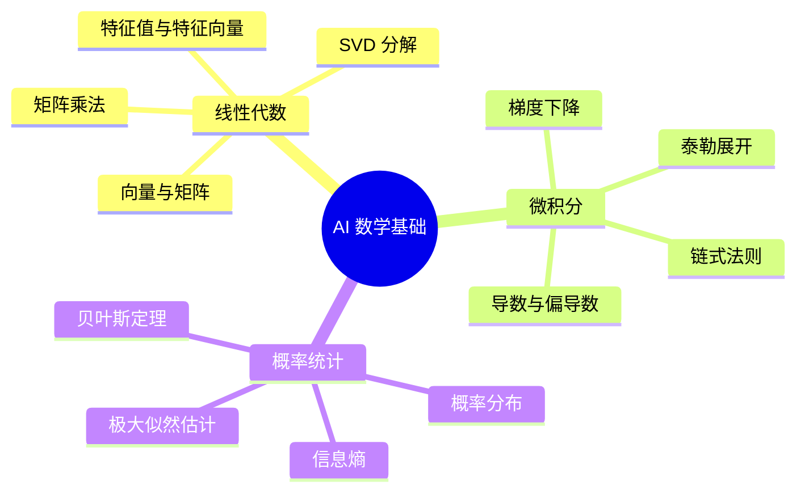
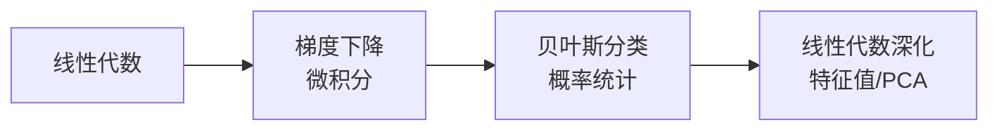

# 📐 数学基础总览

> AI 需要的数学不是"证明一切定理"，而是**理解直觉 + 能写代码验证**。
> 三个支柱：线性代数（数据的语言）、微积分（优化的引擎）、概率统计（不确定性的语言）。

---

## 🗺️ 三柱知识地图



---

## 📊 学习清单

| 模块 | 笔记 | 核心应用 | 状态 |
|------|------|---------|------|
| 线性代数 | [[02.数学基础/02.01 线性代数实战（NumPy）\|线性代数实战]] | 神经网络前向传播、PCA、推荐系统 | ✅ 已创建 |
| 微积分 | [[02.数学基础/02.02 微积分实战：梯度下降从零实现\|微积分实战]] | 反向传播、优化器原理 | 🆕 |
| 概率统计 | [[02.数学基础/02.03 概率统计实战：贝叶斯分类器\|概率统计实战]] | 损失函数、贝叶斯推断、生成模型 | 🆕 |

---

## 💡 学习原则

### 1. 代码优先，数学验证
不要先啃公式再看代码。**反过来**——跑通代码，看着输出反推公式含义。

```
❌ 错误：先读泰勒展开公式 → 看不懂 → 放弃
✅ 正确：先跑 NumPy 梯度下降 → 发现步子太大震荡 → 回头看学习率 → 自然理解导数的几何意义
```

### 2. 三问法
每学一个数学概念，回答三个问题：
- 📍 **在哪用？** 这个概念在哪个 AI 模型/算法中出现？
- 🎯 **为什么？** 为什么用这个概念而不是别的？
- 💻 **怎么写？** 用代码怎么实现？

### 3. 不求全，求够用
| 你不需要 | 你需要 |
|---------|--------|
| ❌ 手工计算复杂的矩阵逆 | ✅ 知道 `np.linalg.inv()` 什么时候用 |
| ❌ 证明链式法则 | ✅ 理解计算图里的梯度怎么传 |
| ❌ 推导贝叶斯公式的积分形式 | ✅ 会用贝叶斯做垃圾邮件分类 |

---

## 📐 各概念与 AI 的映射关系

| 数学概念 | AI 中的应用 | 首次出现阶段 |
|---------|-----------|------------|
| 矩阵乘法 | 神经网络前向传播 $h = Wx + b$ | Phase 2 |
| 特征值/SVD | PCA 降维、推荐系统 | Phase 2 |
| 偏导数 | 梯度计算 | Phase 2 |
| 链式法则 | 反向传播 | Phase 3 |
| 梯度 | 参数更新 $w = w - \eta \nabla L$ | Phase 2 |
| 正态分布 | 权重初始化、数据标准化 | Phase 3 |
| 贝叶斯定理 | 朴素贝叶斯、生成模型 | Phase 2 |
| 极大似然估计 | 损失函数推导（交叉熵 = MLE） | Phase 3 |
| 信息熵/交叉熵 | 分类损失函数 | Phase 2 |

---

## 🔄 学习路线建议



> 建议顺序：线性代数（1周）→ 微积分（1周）→ 概率统计（1周）→ 回到 ML 实践

---

## 🔗 相关笔记

- [[01.00 Phase1-基础入门|◀ 返回 Phase 1]]
- [[00.规划/00.00 AI学习路线图|◀ 返回主路线图]]
- [[99.资源与工具/学习资源汇总#数学|数学学习资源汇总]]
