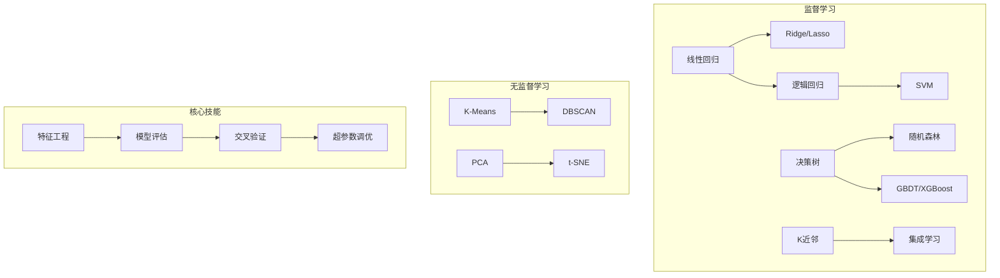

# 🔵 Phase 2：机器学习

> **目标**：掌握经典 ML 算法原理 + Sklearn 实践，完成一个 Kaggle 入门比赛。

---

## 📋 知识地图

---

## 🧩 第一部分：监督学习

### 1.1 线性回归
- [ ] 最小二乘法 vs 梯度下降法
- [ ] 多元线性回归
- [ ] 正则化：Ridge / Lasso / ElasticNet
- [ ] 评估指标：MSE, MAE, R²

**实践** → [[03.机器学习/03.01 线性回归实战：房价预测]]

### 1.2 逻辑回归（分类）
- [ ] Sigmoid 函数与对数几率
- [ ] 交叉熵损失
- [ ] 多分类：Softmax
- [ ] 评估指标：准确率、精确率、召回率、F1、AUC-ROC

**实践** → [[03.机器学习/03.02 逻辑回归实战：二分类任务]]

### 1.3 决策树与集成学习
- [ ] 信息增益 vs 基尼系数
- [ ] 剪枝策略
- [ ] 随机森林
- [ ] GBDT / XGBoost / LightGBM
- [ ] Bagging vs Boosting

**实践** → [[03.机器学习/03.03 决策树与随机森林实战]]

### 1.4 SVM
- [ ] 最大间隔分类器
- [ ] 核技巧（RBF, Polynomial）
- [ ] 软间隔与 C 参数

### 1.5 KNN
- [ ] K 值选择
- [ ] 距离度量
- [ ] 维度灾难

---

## 🔍 第二部分：无监督学习

### 2.1 聚类
- [ ] K-Means（K 值选择 + 初始化）
- [ ] 层次聚类
- [ ] DBSCAN（密度聚类）

**实践** → [[03.机器学习/03.04 聚类实战：用户分群]]

### 2.2 降维
- [ ] PCA（主成分分析）
- [ ] t-SNE（可视化）
- [ ] 特征选择 vs 特征提取

---

## ⚙️ 第三部分：ML 核心工程

### 3.1 特征工程
- [ ] 数值特征（标准化、归一化、分箱）
- [ ] 类别特征（独热编码、Label Encoding）
- [ ] 缺失值处理
- [ ] 特征交叉

### 3.2 模型评估与调优
- [ ] 交叉验证（K-Fold, Stratified）
- [ ] 学习曲线与验证曲线
- [ ] 网格搜索 / 随机搜索
- [ ] 过拟合与欠拟合诊断

---

## 🚀 实践项目：Kaggle 入门

- [ ] **Titanic** — 分类入门（必做）
- [ ] **House Prices** — 回归进阶
- [ ] **Iris / Wine** — 练手小数据集

参见 → [[03.机器学习/03.05 Kaggle入门指南]]

---

## ✅ 阶段验收标准

- [ ] **Task 1**：用 Sklearn 完成 Titanic 分类（特征工程 → 模型 → 调优 → 提交）
- [ ] **Task 2**：从零实现线性回归和逻辑回归（只用 NumPy）
- [ ] **Task 3**：能解释过拟合、欠拟合、正则化、交叉验证
- [ ] **Task 4**：所有笔记整理完毕，体系化链接

---

## 📚 推荐资源

- [Scikit-learn 官方文档](https://scikit-learn.org/stable/)
- [Kaggle Learn 微课程](https://www.kaggle.com/learn)
- [StatQuest 系列视频](https://www.youtube.com/@statquest)（强推！）
- [CS229 课程笔记](https://cs229.stanford.edu/lectures-spring2022/)

---

## 🔗 相关笔记

- [[03.机器学习/03.01 线性回归实战：房价预测]]
- [[03.机器学习/03.02 逻辑回归实战：二分类任务]]
- [[03.机器学习/03.03 决策树与随机森林实战]]
- [[03.机器学习/03.04 聚类实战：用户分群]]
- [[03.机器学习/03.05 Kaggle入门指南]]
- [[01.编程基础/01.00 Phase1-基础入门|◀ 返回 Phase 1]]
- [[04.深度学习/04.00 Phase3-深度学习|▶ 进入 Phase 3]]
- [[00.规划/00.00 AI学习路线图|◀ 返回主路线图]]
