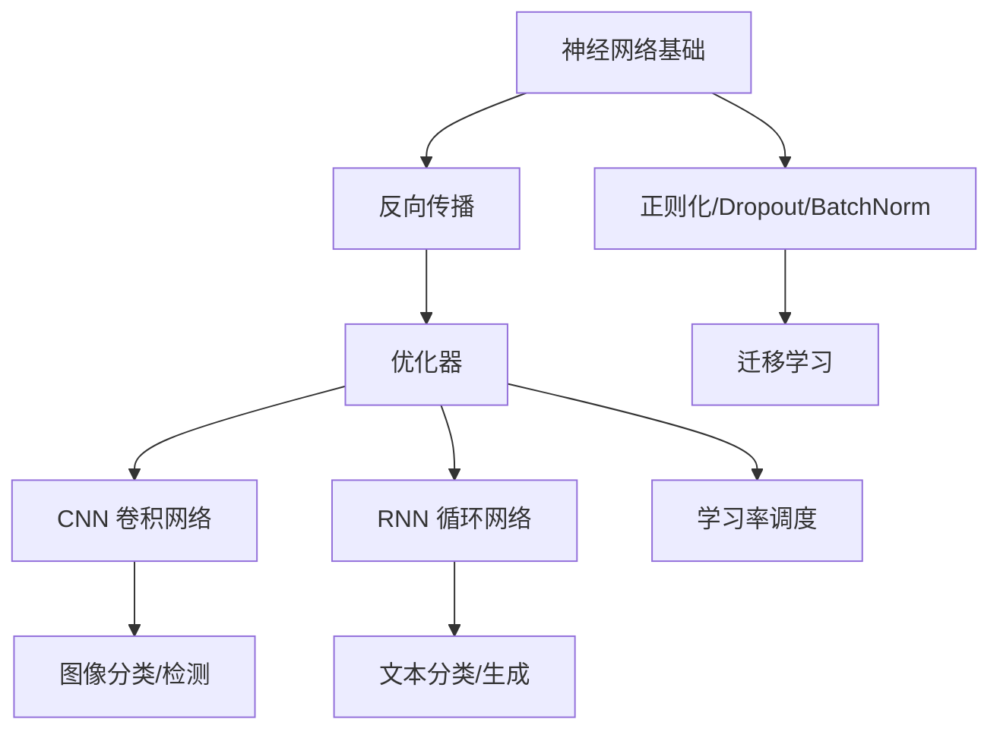

# 🟣 Phase 3：深度学习

> **目标**：理解神经网络原理，熟练使用 PyTorch，掌握 CNN 和 RNN。

---

## 📋 知识地图

---

## 🧠 第一部分：神经网络基础

### 1.1 感知机与多层网络
- [ ] 单个神经元（线性 + 激活函数）
- [ ] 多层感知机（MLP）
- [ ] 常见激活函数：ReLU, Sigmoid, Tanh, Softmax
- [ ] 为什么需要非线性？

**实践** → [[04.深度学习/04.01 从零实现多层感知机]]

### 1.2 反向传播
- [ ] 计算图与链式法则
- [ ] 手动推导 2 层网络的梯度
- [ ] 梯度消失与梯度爆炸

**实践** → [[04.深度学习/04.02 反向传播手动推导]]

### 1.3 PyTorch 入门
- [ ] Tensor 基础（创建、运算、GPU）
- [ ] Autograd 自动求导
- [ ] nn.Module 构建模型
- [ ] DataLoader 数据加载
- [ ] 训练循环模板（train/val/test）

**实践** → [[04.深度学习/04.03 PyTorch入门实战：MNIST分类]]

### 1.4 优化器与损失函数
- [ ] SGD + Momentum
- [ ] Adam / AdamW
- [ ] 学习率调度（StepLR, CosineAnnealing）
- [ ] 常见损失函数：CrossEntropy, MSE, BCELoss

---

## 🖼️ 第二部分：CNN 卷积神经网络

### 2.1 卷积核心概念
- [ ] 卷积运算（手动计算）
- [ ] Padding & Stride
- [ ] 池化层（MaxPool, AvgPool）
- [ ] 感受野
- [ ] 参数共享与稀疏连接

### 2.2 经典架构
- [ ] LeNet-5（理解结构）
- [ ] AlexNet（ReLU + Dropout）
- [ ] VGG（小卷积核堆叠）
- [ ] ResNet（残差连接 + BatchNorm）

**实践** → [[04.深度学习/04.04 CNN实战：CIFAR-10图像分类]]

### 2.3 训练技巧
- [ ] 数据增强（翻转、旋转、裁剪）
- [ ] Dropout
- [ ] Batch Normalization
- [ ] 迁移学习（用预训练模型做微调）

---

## 🔄 第三部分：RNN 与序列模型

### 3.1 RNN 基础
- [ ] 循环神经网络结构
- [ ] 随时间反向传播（BPTT）
- [ ] 长期依赖问题

### 3.2 LSTM & GRU
- [ ] LSTM 三门结构（遗忘门、输入门、输出门）
- [ ] GRU（简化版 LSTM）
- [ ] 双向 RNN

**实践** → [[04.深度学习/04.05 RNN实战：情感分析]]

---

## ✅ 阶段验收标准

- [ ] **Task 1**：从零实现一个 2 层神经网络（只使用 NumPy）
- [ ] **Task 2**：用 PyTorch 在 CIFAR-10 上训练 CNN，达到 >80% 准确率
- [ ] **Task 3**：用预训练 ResNet 做迁移学习，完成自定义图像分类
- [ ] **Task 4**：用 LSTM 完成一个文本分类或时间序列预测

---

## 📚 推荐资源

- [d2l.ai 动手学深度学习](https://d2l.ai/) — 最佳教材
- [PyTorch 官方教程](https://pytorch.org/tutorials/)
- [CS231n 课程](http://cs231n.stanford.edu/)
- [Andrej Karpathy: 从零构建 GPT](https://www.youtube.com/watch?v=kCc8FmEb1nY)

---

## 🔗 相关笔记

- [[04.深度学习/04.01 从零实现多层感知机]]
- [[04.深度学习/04.02 反向传播手动推导]]
- [[04.深度学习/04.03 PyTorch入门实战：MNIST分类]]
- [[04.深度学习/04.04 CNN实战：CIFAR-10图像分类]]
- [[04.深度学习/04.05 RNN实战：情感分析]]
- [[03.机器学习/03.00 Phase2-机器学习|◀ 返回 Phase 2]]
- [[05.NLP/05.00 Phase4-NLP与CV|▶ 进入 Phase 4]]
- [[00.规划/00.00 AI学习路线图|◀ 返回主路线图]]
