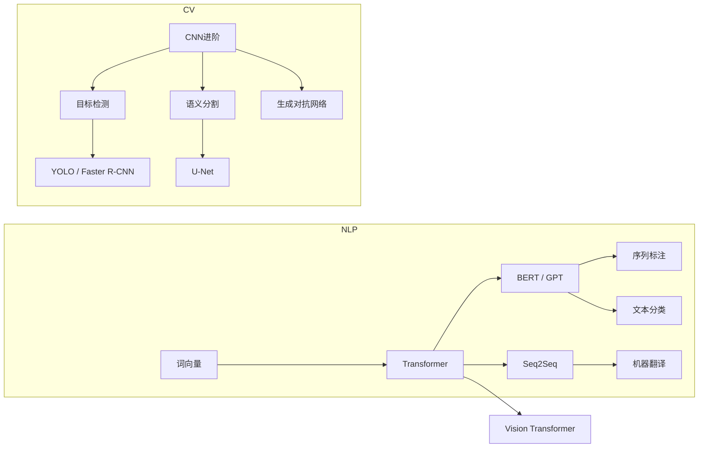

# 🟡 Phase 4：NLP & 计算机视觉

> **目标**：掌握 Transformer 架构，了解 NLP 和 CV 的核心任务与模型。

---

## 📋 知识地图

---

## 📝 第一部分：自然语言处理 (NLP)

### 1.1 词向量表示
- [ ] One-hot 编码 vs 分布式表示
- [ ] Word2Vec (CBOW + Skip-gram)
- [ ] GloVe
- [ ] 词向量的语义特性（类比推理）

**实践** → [[05.NLP/05.01 词向量实战：Word2Vec训练与可视化]]

### 1.2 Seq2Seq 与 Attention
- [ ] Encoder-Decoder 架构
- [ ] RNN-based Seq2Seq
- [ ] Attention 机制（Bahdanau vs Luong）
- [ ] 机器翻译实战

**实践** → [[05.NLP/05.02 Seq2Seq实战：神经机器翻译]]

### 1.3 🔥 Transformer — 划时代架构
- [ ] Self-Attention 数学原理
- [ ] Multi-Head Attention
- [ ] Positional Encoding
- [ ] Layer Norm & Residual Connection
- [ ] Masked Self-Attention

**核心实践** → [[05.NLP/05.03 Transformer从零实现]]
- [ ] 从零实现 Scaled Dot-Product Attention
- [ ] 实现 Multi-Head Attention
- [ ] 搭建完整的 Transformer 模块

### 1.4 BERT 与预训练模型
- [ ] Masked LM + Next Sentence Prediction
- [ ] Fine-tuning 范式
- [ ] Hugging Face Transformers 库
- [ ] 文本分类、NER、QA 实战

**实践** → [[05.NLP/05.04 BERT微调实战：文本分类]]

---

## 👁️ 第二部分：计算机视觉 (CV)

### 2.1 CNN 进阶
- [ ] 1x1 卷积
- [ ] 深度可分离卷积
- [ ] 分组卷积

### 2.2 目标检测
- [ ] 两阶段：Faster R-CNN
- [ ] 单阶段：YOLO (you only look once)
- [ ] 评估指标：mAP, IoU

**实践** → [[06.计算机视觉/06.02 目标检测实战：YOLO]]

### 2.3 图像分割
- [ ] 语义分割：FCN, U-Net
- [ ] 实例分割：Mask R-CNN

**实践** → [[06.计算机视觉/06.03 图像分割实战：U-Net]]

### 2.4 生成模型
- [ ] GAN 原理（生成器 + 判别器）
- [ ] DCGAN
- [ ] VAE（变分自编码器）

**实践** → [[06.计算机视觉/06.04 GAN实战：生成手写数字]]

---

## ✅ 阶段验收标准

- [ ] **Task 1**：从零实现 Transformer 的 Self-Attention + Multi-Head Attention
- [ ] **Task 2**：用 Hugging Face 微调 BERT 完成一个文本分类任务
- [ ] **Task 3**：理解并实现一个简单的目标检测流程
- [ ] **Task 4**：训练一个 DCGAN 生成图像

---

## 📚 推荐资源

- [Stanford CS224n (NLP)](https://web.stanford.edu/class/cs224n/)
- [Stanford CS231n (CV)](http://cs231n.stanford.edu/)
- [Hugging Face NLP Course](https://huggingface.co/learn/nlp-course)
- [The Annotated Transformer](http://nlp.seas.harvard.edu/2018/04/03/attention.html)
- [d2l.ai 第 10-14 章](https://d2l.ai/)

---

## 🔗 相关笔记

- [[05.NLP/05.01 词向量实战：Word2Vec训练与可视化]]
- [[05.NLP/05.02 Seq2Seq实战：神经机器翻译]]
- [[05.NLP/05.03 Transformer从零实现]]
- [[05.NLP/05.04 BERT微调实战：文本分类]]
- [[04.深度学习/04.00 Phase3-深度学习|◀ 返回 Phase 3]]
- [[07.大语言模型LLM/07.00 Phase5-大语言模型|▶ 进入 Phase 5]]
- [[00.规划/00.00 AI学习路线图|◀ 返回主路线图]]
