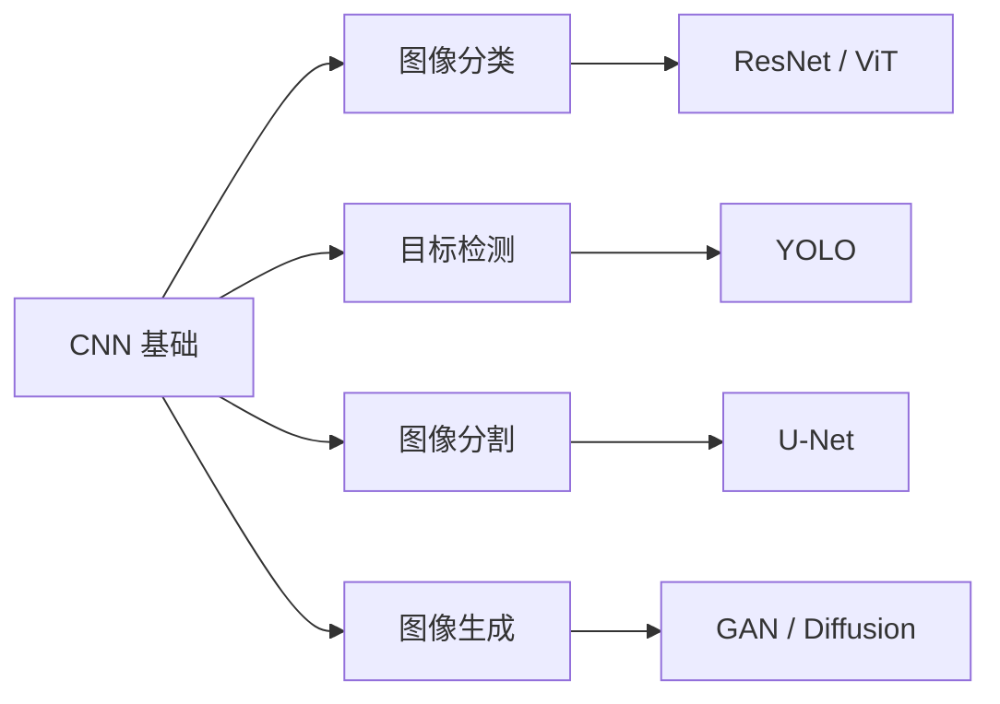

# 👁️ 计算机视觉总览

> 从"图里有什么"到"每个像素是什么"。CV 四大任务：分类 → 检测 → 分割 → 生成。

---

## 🗺️ 知识地图

---

## 📊 学习清单

| 模块 | 笔记 | 核心技能 | 状态 |
|------|------|---------|------|
| CNN 进阶 | [[06.计算机视觉/06.01 CNN进阶卷积操作\|CNN进阶卷积操作]] | 1x1卷积 / 深度可分离 / 分组卷积 | ✅ |
| 目标检测 | [[06.计算机视觉/06.02 目标检测实战：YOLO\|目标检测实战：YOLO]] | IoU / mAP / Anchor / Ultralytics | ✅ |
| 图像分割 | [[06.计算机视觉/06.03 图像分割实战：U-Net\|图像分割实战：U-Net]] | Skip Connect / 上采样 / Dice Loss | ✅ |
| 图像生成 | [[06.计算机视觉/06.04 GAN实战：生成手写数字\|GAN实战：生成手写数字]] | DCGAN / 模式坍塌 / WGAN-GP | ✅ |

---

## 🎯 CV 四大任务对比

| 任务 | 输入 | 输出 | 代表模型 | 评估指标 |
|------|------|------|---------|---------|
| 分类 | 图片 | 一个标签 | ResNet, ViT | Accuracy |
| 检测 | 图片 | 多个框+标签 | YOLO, Faster R-CNN | mAP@IoU |
| 分割 | 图片 | 每个像素的标签 | U-Net, Mask R-CNN | Dice, IoU |
| 生成 | 噪声/文本 | 一张新图片 | GAN, Stable Diffusion | FID, IS |

---

## 🔗 相关笔记

- [[05.NLP/05.00 Phase4-NLP与CV|◀ 返回 Phase 4]]
- [[04.深度学习/04.04 CNN实战：CIFAR-10图像分类]]
- [[00.规划/00.00 AI学习路线图|◀ 返回主路线图]]
