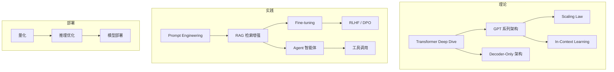
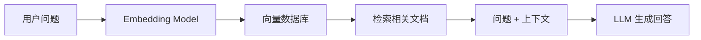

# 🔴 Phase 5：大语言模型 (LLM)

> **目标**：深入理解 LLM 原理，掌握 Prompt Engineering、RAG、Fine-tuning、Agent 等核心技术。

---

## 📋 知识地图

---

## 📖 第一部分：LLM 理论基础

### 1.1 从 Transformer 到 GPT
- [ ] Decoder-Only 架构详解
- [ ] GPT 系列演进（GPT-1 → GPT-2 → GPT-3 → GPT-4）
- [ ] 自回归生成（Autoregressive Generation）
- [ ] Temperature / Top-k / Top-p 采样

**实践** → [[07.大语言模型LLM/07.01 从零实现GPT生成]]

### 1.2 Scaling Law 与涌现能力
- [ ] 模型规模与数据规模的关系
- [ ] 涌现能力（Emergent Abilities）
- [ ] 上下文学习（In-Context Learning）
- [ ] Chain-of-Thought 推理

### 1.3 开源 LLM 生态
- [ ] LLaMA / LLaMA 2 / LLaMA 3
- [ ] Mistral / Mixtral
- [ ] Qwen / DeepSeek
- [ ] ChatGLM

---

## 🎯 第二部分：核心技能

### 2.1 Prompt Engineering（提示工程）
- [ ] Zero-shot / Few-shot Prompting
- [ ] Chain-of-Thought (CoT)
- [ ] Tree-of-Thought (ToT)
- [ ] 结构化 Prompt（角色、指令、输出格式）
- [ ] 系统提示 vs 用户提示

**实践** → [[07.大语言模型LLM/07.02 Prompt工程实战]]

### 2.2 🔥 RAG（检索增强生成）

- [ ] Embedding Model 选型
- [ ] 向量数据库（Chroma, FAISS, Qdrant）
- [ ] 文档分块策略
- [ ] 检索（相似度搜索 + 混合检索）
- [ ] Rerank 重排序
- [ ] 高级 RAG（Graph RAG, Agentic RAG）

**核心实践** → [[07.大语言模型LLM/07.03 RAG实战：搭建知识库问答系统]]

### 2.3 Fine-tuning（微调）
- [ ] 全量微调 vs 参数高效微调
- [ ] LoRA / QLoRA 原理
- [ ] PEFT 库实战
- [ ] 数据集准备与格式
- [ ] 微调后的评估

**实践** → [[07.大语言模型LLM/07.04 LoRA微调实战：领域适配]]

### 2.4 RLHF & DPO
- [ ] RLHF 流程（SFT → RM → PPO）
- [ ] DPO（Direct Preference Optimization）
- [ ] 偏好数据构建

---

## 🤖 第三部分：Agent 与工具使用

### 3.1 智能体基础
- [ ] ReAct 模式（Reasoning + Acting）
- [ ] Function Calling / Tool Use
- [ ] 记忆管理（短期 + 长期）

### 3.2 LangChain / LlamaIndex
- [ ] Chain（链式调用）
- [ ] Tool（工具定义）
- [ ] Agent（智能体循环）
- [ ] Memory（记忆模块）

**实践** → [[07.大语言模型LLM/07.05 LangChain实战：搭建AI助手]]

### 3.3 多 Agent 系统
- [ ] AutoGen / CrewAI
- [ ] Agent 协作模式

---

## 🚀 第四部分：模型部署与推理

- [ ] 模型量化（GPTQ, AWQ, GGUF）
- [ ] vLLM / TGI 推理框架
- [ ] Ollama 本地部署
- [ ] API 服务搭建（FastAPI）

---

## ✅ 阶段验收标准

- [ ] **Task 1**：搭建一个完整的 RAG 知识库问答系统（含 UI）
- [ ] **Task 2**：用 LoRA 微调一个开源模型，完成领域任务
- [ ] **Task 3**：用 LangChain 实现一个 Agent（能调用搜索、计算等工具）
- [ ] **Task 4**：本地部署一个开源模型，提供 API 服务

---

## 📚 推荐资源

- [Hugging Face NLP Course](https://huggingface.co/learn/nlp-course)
- [LLM University (Cohere)](https://cohere.com/llmu)
- [Lilian Weng's Blog](https://lilianweng.github.io/)（LLM 综述必读）
- [Andrej Karpathy: Let's build GPT](https://www.youtube.com/watch?v=kCc8FmEb1nY)
- [LangChain 官方文档](https://python.langchain.com/docs/get_started/introduction)

---

## 🔗 相关笔记

- [[07.大语言模型LLM/07.01 从零实现GPT生成]]
- [[07.大语言模型LLM/07.02 Prompt工程实战]]
- [[07.大语言模型LLM/07.03 RAG实战：搭建知识库问答系统]]
- [[07.大语言模型LLM/07.04 LoRA微调实战：领域适配]]
- [[07.大语言模型LLM/07.05 LangChain实战：搭建AI助手]]
- [[05.NLP/05.00 Phase4-NLP与CV|◀ 返回 Phase 4]]
- [[08.前沿与工程化/08.00 Phase6-前沿与工程化|▶ 进入 Phase 6]]
- [[00.规划/00.00 AI学习路线图|◀ 返回主路线图]]
