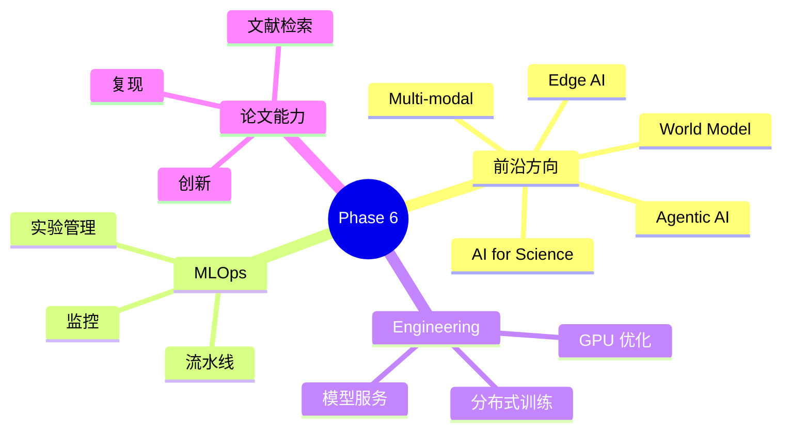

# ⚫ Phase 6：前沿探索与工程化

> **目标**：从"会用"到"会造"，培养独立研究与工程交付能力，追踪前沿动态。

---

## 📋 知识地图

---

## 🔬 第一部分：前沿方向探索

> 从以下方向中选择 1-2 个深入，不要求全部覆盖。

### 1.1 多模态 AI
- [ ] CLIP（图文对齐）
- [ ] Stable Diffusion / DALL-E
- [ ] LLaVA（视觉语言模型）
- [ ] 多模态 RAG

**实践** → [[08.前沿与工程化/08.01 多模态应用实战]]

### 1.2 Agentic AI
- [ ] 计算机使用（Computer Use）
- [ ] 自主编程 Agent（Devin/Cursor 原理）
- [ ] MCP（Model Context Protocol）
- [ ] Agent 评估与安全

**实践** → [[08.前沿与工程化/08.03 Agentic AI与MCP实战]]

### 1.3 AI for Science
- [ ] AlphaFold
- [ ] AI + 药物发现
- [ ] 物理信息神经网络 (PINN)

### 1.4 模型架构创新
- [ ] Mamba（状态空间模型）
- [ ] MoE（混合专家）
- [ ] 长上下文技术（RoPE, ALiBi）
- [ ] 推理时计算（Test-Time Compute）

---

## ⚙️ 第二部分：MLOps 工程化

### 2.1 实验管理
- [ ] MLflow / Weights & Biases
- [ ] 实验追踪（超参数、指标、产物）
- [ ] 模型版本管理

### 2.2 数据与训练流水线
- [ ] 数据版本控制（DVC）
- [ ] 分布式训练（DDP, DeepSpeed）
- [ ] 混合精度训练（FP16, BF16）

### 2.3 模型部署
- [ ] 模型服务框架（TorchServe, Triton, BentoML）
- [ ] Docker 容器化
- [ ] CI/CD for ML
- [ ] A/B 测试与模型监控

**实践** → [[08.前沿与工程化/08.02 MLOps实战：模型部署流水线]]

### 2.4 GPU 优化
- [ ] CUDA 基础
- [ ] Flash Attention
- [ ] 显存优化（Gradient Checkpointing, Offloading）
- [ ] 推理优化（KV Cache, Speculative Decoding）

**实践** → [[08.前沿与工程化/08.04 GPU优化与推理加速]]

---

## 📑 第三部分：论文阅读能力

> 贯穿始终的硬技能，从 Phase 4 开始就应该逐步培养。

### 阅读方法论
1. **三遍阅读法**（Keshav 法）
   - 第一遍：读标题、摘要、图表 → 了解是否相关
   - 第二遍：读引言、方法、实验 → 理解核心贡献
   - 第三遍：深入推导，发现不足 → 寻找改进点
2. **笔记模板** → [[10.论文阅读/10.01 论文笔记模板]]
3. **方法论** → [[08.前沿与工程化/08.05 论文阅读与复现方法论]]

### 论文来源
- [Arxiv](https://arxiv.org/) — 最新预印本
- [Papers With Code](https://paperswithcode.com/) — 论文+代码
- [Hugging Face Daily Papers](https://huggingface.co/papers)
- [Semantic Scholar](https://www.semanticscholar.org/)

### 每周论文计划
- [ ] 每周精读 1 篇核心论文
- [ ] 每周速读 3-5 篇相关论文
- [ ] 每月复现 1 篇论文的核心实验

---

## 🎯 第四部分：终极项目

选择 1-2 个方向，做一个有影响力的完整项目：

| 项目方向 | 说明 | 参考 |
|---------|------|------|
| 个人 AI 助手 | RAG + Agent + 多模态 | [[09.实践项目/Phase6/09.21 个人AI助手]] |
| 垂直领域知识库 | 法律/医疗/代码问答 | [[09.实践项目/Phase6/09.22 领域知识库]] |
| AI 应用产品 | 开源 + 部署 + 运营 | [[09.实践项目/Phase6/09.23 AI产品开发]] |
| 论文复现+改进 | 选一篇顶会论文复现并改进 | [[09.实践项目/Phase6/09.20 P20-论文复现]] |

---

## ✅ 阶段验收标准

- [ ] **Task 1**：独立完成一个端到端 AI 项目（从数据到部署）
- [ ] **Task 2**：精读并复现 5+ 篇顶会论文
- [ ] **Task 3**：搭建 MLOps 流水线（实验管理 → 训练 → 部署 → 监控）
- [ ] **Task 4**：输出自己的技术博客/笔记体系，能清晰讲解复杂概念

---

## 📚 推荐资源

- [MLOps 基础](https://ml-ops.org/)
- [The Batch (DeepLearning.AI)](https://www.deeplearning.ai/the-batch/)
- [Arxiv Sanity](https://arxiv-sanity-lite.com/) — 论文推荐
- [CS329x (ML Deployment)](https://cs329x.stanford.edu/)

---

## 🔗 相关笔记

- [[08.前沿与工程化/08.01 多模态应用实战]]
- [[08.前沿与工程化/08.02 MLOps实战：模型部署流水线]]
- [[08.前沿与工程化/08.03 Agentic AI与MCP实战]]
- [[08.前沿与工程化/08.04 GPU优化与推理加速]]
- [[08.前沿与工程化/08.05 论文阅读与复现方法论]]
- [[07.大语言模型LLM/07.00 Phase5-大语言模型|◀ 返回 Phase 5]]
- [[10.论文阅读/10.01 论文笔记模板]]
- [[09.实践项目/09.00 实践项目索引]]
- [[00.规划/00.00 AI学习路线图|◀ 返回主路线图]]
