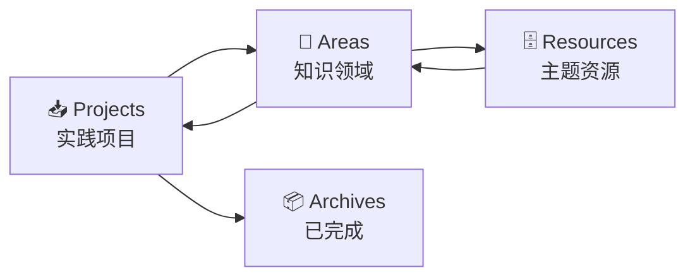

# ⚡ Obsidian 学习工作流

> 如何用 Obsidian 高效学习 AI：一套完整的学习循环系统。

---

## 🔄 P.A.R.A 学习循环

将 P.A.R.A 方法适配到 AI 学习中：



### 对应到本 vault 结构

| 层级 | Obsidian 文件夹 | 说明 |
|------|---------------|------|
| **Projects** | `09.实践项目/` | 正在进行的项目（Kaggle、RAG 系统等） |
| **Areas** | `01.~08.` 各阶段文件夹 | 持续负责的知识领域 |
| **Resources** | `99.资源与工具/` | 按主题组织的参考资料 |
| **Archives** | 非活跃内容 | 已完成、不再活跃的项目 |

---

## 📝 笔记类型系统

### 1. 概念笔记 (Concept Notes)

```markdown
# 概念名称

## 一句话解释
> 

## 核心公式
$$

## 直觉理解
（画图或用比喻解释）

## 代码实现
\`\`\`python

\`\`\`

## 相关概念
- [[概念A]]
- [[概念B]]
```

### 2. 论文笔记 (Paper Notes)

```markdown
# 论文标题

## 元信息
- 作者：
- 年份：
- 会议：
- 链接：

## 核心贡献

## 方法

## 实验结果

## 我的思考
```

### 3. 每日学习日志 (Daily Log)

```markdown
# YYYY-MM-DD 学习日志

## 今日目标
- [ ] 

## 学习内容

## 代码/实验

## 问题与思考
```

### 4. 实践笔记 (Practice Notes)

```markdown
# 实验名称

## 目标

## 方法/实现

## 结果

## 反思
```

---

## 🔗 链接策略

### 黄金三原则
1. **每篇笔记至少 3 个出链** → 指向相关概念或上一级
2. **每篇笔记至少被 1 个入链引用** → 否则说明它孤立无援
3. **标签是分类，链接是理解** → 用标签做筛选，用链接做知识网络

### 链接示例
```
# 梯度下降

## 相关概念
- [[损失函数]] — 梯度下降要优化的目标
- [[反向传播]] — 计算梯度的具体方法
- [[学习率]] — 控制下降步长的超参数
- [[03.00 Phase2-机器学习]] — 本概念的上层阶段
```

---

## 📊 Dataview 查询模板

### 全部未完成任务
```dataview
TASK FROM ""
WHERE !completed
GROUP BY file.folder
```

### 最近修改的笔记
```dataview
TABLE file.mtime AS "修改时间"
FROM ""
SORT file.mtime desc
LIMIT 10
```

### 某阶段进度
```dataview
TABLE
  status AS "状态",
  duration AS "预计时长"
FROM "04.深度学习"
WHERE phase
SORT phase asc
```

---

## 🔧 我的 Obsidian 配置总结

| 配置项 | 设置 |
|-------|------|
| 主题 | 选择护眼深色主题（如 Minimal Theme） |
| 编辑器 | 源码模式 |
| 图片目录 | `附件/` |
| 模板目录 | `99.资源与工具/模板/` |
| 每日笔记 | 不自动创建（建议自己按需用 Templater 创建） |
| 自动提交 | Git 插件每 15 分钟自动备份 |

---

## 🔗 相关笔记

- [[01.编程基础/01.90 Obsidian插件配置指南]]
- [[00.规划/00.00 AI学习路线图|◀ 返回主路线图]]
- [[99.资源与工具/99.02 学习资源汇总]]
